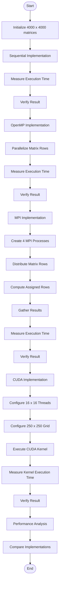
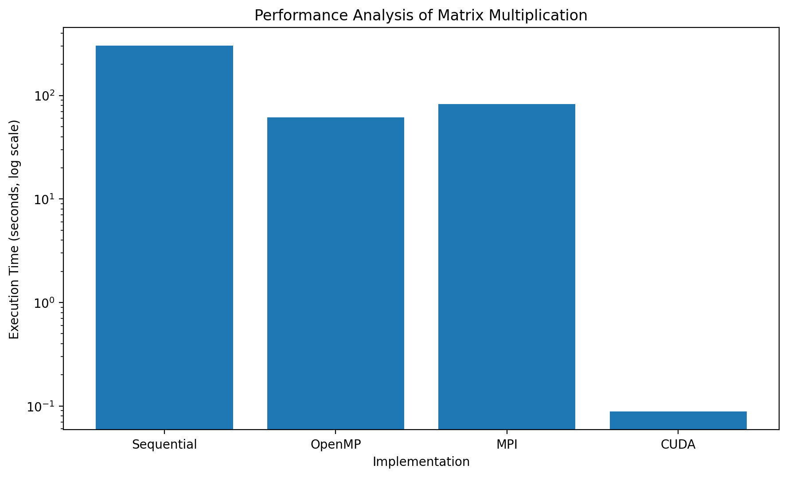

# Parallel Matrix Multiplication — Performance Analysis

## 1. Introduction

This experiment implements **4000 × 4000 matrix multiplication** using four different approaches:

* Sequential C
* OpenMP
* MPI
* CUDA

The objective is to implement the same matrix multiplication problem using different programming models, measure execution performance, and verify the correctness of the results.

---

## 2. Objectives

* Implement matrix multiplication using a sequential approach.
* Parallelize matrix multiplication using OpenMP.
* Distribute matrix multiplication using MPI.
* Implement matrix multiplication using CUDA.
* Measure execution time for each implementation.
* Verify the correctness of the computed matrix.
* Compare the performance of the four implementations.

---

## 3. Problem Configuration

| Parameter           | Value       |
| ------------------- | ----------- |
| Matrix Size         | 4000 × 4000 |
| Matrix Elements     | 16,000,000  |
| Input Matrix Values | 1.0         |
| Expected `C[0][0]`  | 4000.00     |
| MPI Processes       | 4           |
| CUDA Block Size     | 16 × 16     |
| CUDA Grid Size      | 250 × 250   |

Since the input matrices are initialized with `1.0`, every element of the resulting matrix is expected to be:

```text
C[i][j] = 4000.00
```

Therefore, the correctness check is:

```text
C[0][0] = 4000.00
```

---

# 4. Overall Experiment Flowchart

The complete experiment follows the workflow below.



---

# 5. Part A — Sequential Matrix Multiplication

## Description

The sequential implementation performs matrix multiplication using the conventional triple-loop method.

For matrices `A` and `B`, each element of the result matrix `C` is calculated as:

```text
C[i][j] = Σ A[i][k] × B[k][j]
```

The implementation uses a matrix size of **4000 × 4000**.

## Result

| Parameter      |              Result |
| -------------- | ------------------: |
| Matrix Size    |         4000 × 4000 |
| Execution Time |  303.118438 seconds |
| Verification   | `C[0][0] = 4000.00` |

---

# 6. Part B — OpenMP Matrix Multiplication

## Description

The OpenMP implementation parallelizes matrix multiplication using multiple CPU threads.

The matrix rows are divided among the available threads, allowing multiple portions of the computation to execute concurrently.

## Result

| Parameter      |              Result |
| -------------- | ------------------: |
| Matrix Size    |         4000 × 4000 |
| Execution Time |   61.120517 seconds |
| Verification   | `C[0][0] = 4000.00` |

---

# 7. Part C — MPI Matrix Multiplication

## Description

The MPI implementation distributes matrix multiplication across **four MPI processes** running on the configured cluster.

The 4000 rows are divided equally among the four processes.

```text
4000 rows / 4 processes = 1000 rows per process
```

## MPI Configuration

| Process | Host    | Rows |
| ------- | ------- | ---: |
| Rank 0  | master  | 1000 |
| Rank 1  | worker1 | 1000 |
| Rank 2  | worker2 | 1000 |
| Rank 3  | worker3 | 1000 |

## Result

| Parameter        |              Result |
| ---------------- | ------------------: |
| Matrix Size      |         4000 × 4000 |
| MPI Processes    |                   4 |
| Rows per Process |                1000 |
| Execution Time   |   82.515692 seconds |
| Verification     | `C[0][0] = 4000.00` |

---

# 8. Part D — CUDA Matrix Multiplication

## Description

The CUDA implementation performs matrix multiplication on an NVIDIA GPU.

Each CUDA thread is responsible for computing an output matrix element. Threads are organized into blocks, and blocks are organized into a grid.

## CUDA Hardware

| Parameter          | Value                      |
| ------------------ | -------------------------- |
| GPU                | NVIDIA GeForce RTX 5060 Ti |
| Compute Capability | 12.0                       |
| CUDA Toolkit       | 13.4                       |

## CUDA Configuration

| Parameter            |       Value |
| -------------------- | ----------: |
| Matrix Size          | 4000 × 4000 |
| Block Size           |     16 × 16 |
| Threads per Block    |         256 |
| Grid Size            |   250 × 250 |
| Total Blocks         |      62,500 |
| Logical CUDA Threads |  16,000,000 |

## Compilation

```bash
nvcc -O2 -arch=sm_120 matrix_cuda.cu -o matrix_cuda.exe
```

## Result

| Parameter                  |                     Result |
| -------------------------- | -------------------------: |
| GPU                        | NVIDIA GeForce RTX 5060 Ti |
| Compute Capability         |                       12.0 |
| Matrix Size                |                4000 × 4000 |
| Block Size                 |                    16 × 16 |
| Grid Size                  |                  250 × 250 |
| CUDA Kernel Execution Time |           0.088401 seconds |
| Verification               |        `C[0][0] = 4000.00` |

---

# 9. Performance Analysis

The following execution times were measured during the experiment.

| Implementation | Execution Time (seconds) |
| -------------- | -----------------------: |
| Sequential     |               303.118438 |
| OpenMP         |                61.120517 |
| MPI            |                82.515692 |
| CUDA           |                 0.088401 |

## Performance Chart



The chart uses a **logarithmic Y-axis** because the measured CUDA kernel time is much smaller than the Sequential, OpenMP, and MPI measurements.

## Performance Observations

* Sequential execution time: **303.118438 seconds**
* OpenMP execution time: **61.120517 seconds**
* MPI execution time: **82.515692 seconds**
* CUDA kernel execution time: **0.088401 seconds**

The results demonstrate the execution-time differences between sequential execution, CPU-based parallelism, distributed-memory parallelism, and GPU-based parallelism.

> **Timing note:** The CUDA value represents the measured CUDA **kernel execution time**, while the CPU and MPI values represent the execution timing reported by their respective programs. Therefore, the timing scopes are not necessarily identical.

---

# 10. Correctness Verification

All four implementations were verified using the first element of the result matrix.

| Implementation | Matrix Size |        Verification |
| -------------- | ----------- | ------------------: |
| Sequential     | 4000 × 4000 | `C[0][0] = 4000.00` |
| OpenMP         | 4000 × 4000 | `C[0][0] = 4000.00` |
| MPI            | 4000 × 4000 | `C[0][0] = 4000.00` |
| CUDA           | 4000 × 4000 | `C[0][0] = 4000.00` |

All four implementations produced the expected verification value of **4000.00**.

---

# 11. Implementation Comparison

| Feature           | Sequential   | OpenMP        | MPI                | CUDA            |
| ----------------- | ------------ | ------------- | ------------------ | --------------- |
| Programming Model | Sequential   | Shared Memory | Distributed Memory | GPU Parallelism |
| Execution Unit    | CPU          | CPU Threads   | MPI Processes      | CUDA Threads    |
| Matrix Size       | 4000 × 4000  | 4000 × 4000   | 4000 × 4000        | 4000 × 4000     |
| Execution Time    | 303.118438 s | 61.120517 s   | 82.515692 s        | 0.088401 s      |
| Verification      | 4000.00      | 4000.00       | 4000.00            | 4000.00         |

---

# 12. Screenshots and Evidence

The CUDA experiment includes screenshots documenting the GPU environment, CUDA compiler, compilation, and final execution.

```text
cuda/
└── screenshots/
    ├── 01_nvidia_smi.png
    ├── 02_nvcc_version.png
    ├── 03_cuda_compile.png
    └── 04_cuda_result.png
```

The screenshots provide evidence of:

1. NVIDIA GPU detection.
2. CUDA compiler installation.
3. Successful CUDA compilation.
4. Successful CUDA execution and result verification.

---

# 13. Repository Structure

```text
pgc-lab/
├── sequential/
├── openmp/
├── mpi/
├── cuda/
├── performance_analysis.png
└── README.md
```

---

# 14. Learning Outcomes

This experiment demonstrates:

* Sequential matrix multiplication.
* Shared-memory parallelism using OpenMP.
* Distributed-memory parallelism using MPI.
* GPU parallelism using CUDA.
* CPU thread-based workload distribution.
* MPI process-based workload distribution.
* CUDA grid and block organization.
* Performance measurement and comparison.
* Computational correctness verification.

---

# 15. Conclusion

This experiment implemented the same **4000 × 4000 matrix multiplication** problem using four different programming approaches: Sequential C, OpenMP, MPI, and CUDA.

All four implementations produced the expected verification result:

```text
C[0][0] = 4000.00
```

The measured execution times were:

```text
Sequential : 303.118438 seconds
OpenMP     :  61.120517 seconds
MPI        :  82.515692 seconds
CUDA       :   0.088401 seconds
```

The experiment provides practical experience with sequential programming, shared-memory parallelism, distributed-memory parallelism, and GPU-based parallelism. It also demonstrates the importance of measuring execution performance and verifying computational correctness.

---

## Author

**Vikitha22**

**Repository:** `Vikitha22/pgc-lab`

---

> **Note:** Execution times depend on the hardware, software environment, configuration, and timing methodology used for each implementation.
